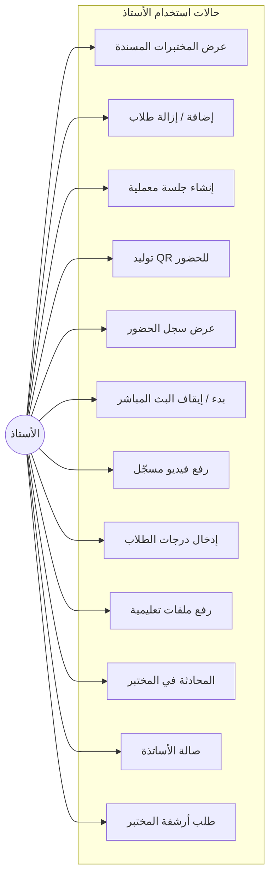
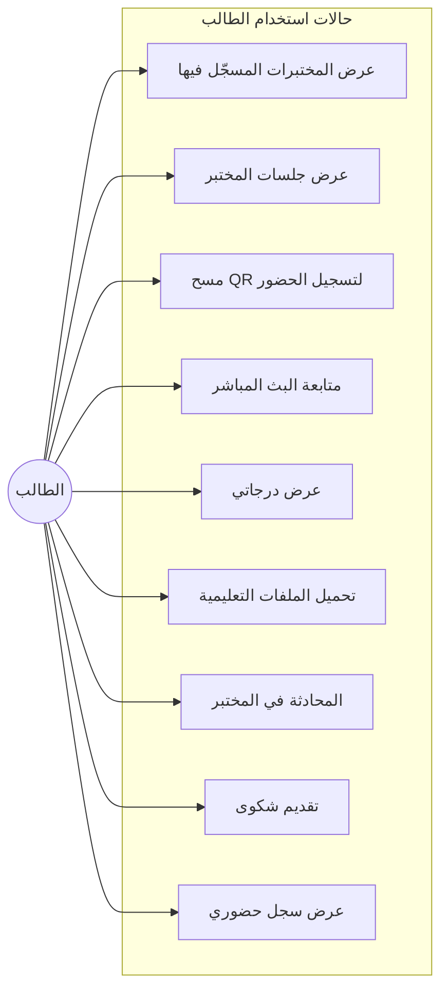
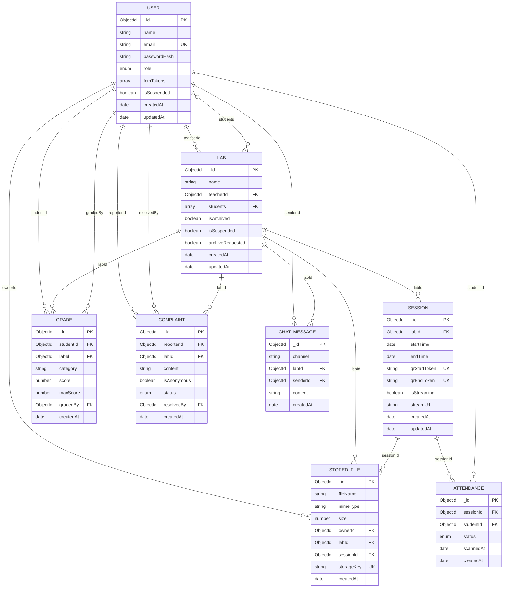
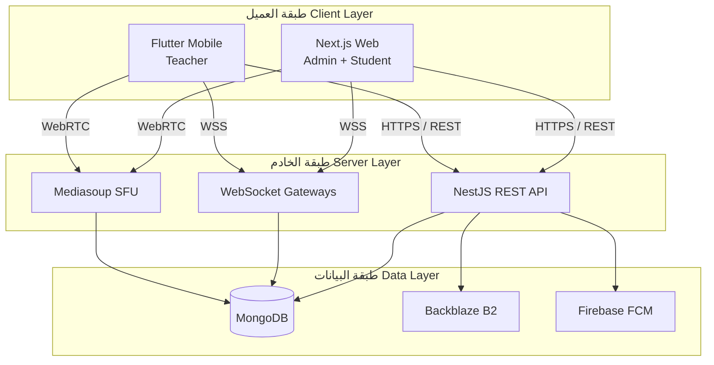
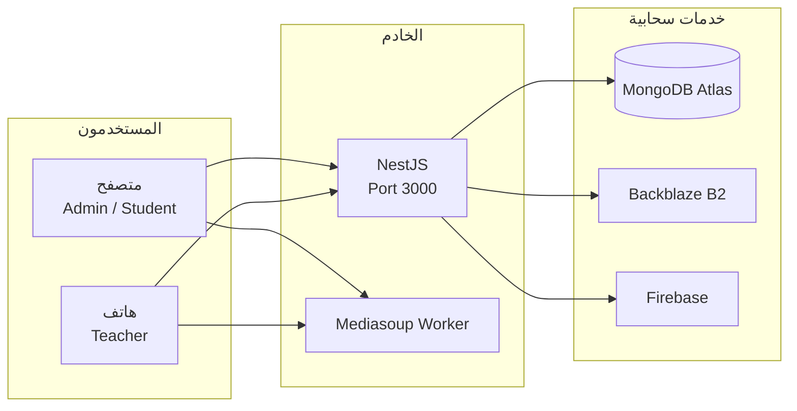
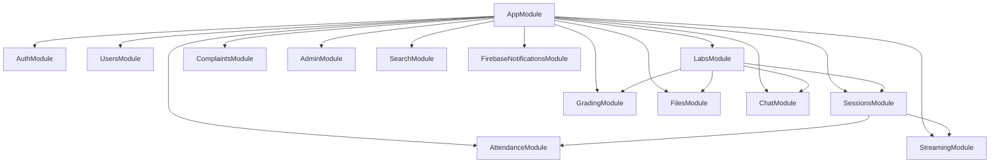

# الفصل الثالث
## مخططات المشروع

---

## مقدمة الفصل

يُعد تصميم المخططات مرحلة أساسية في تحليل أي نظام برمجي، إذ تُمكّن من فهم العلاقات بين المكوّنات، وتحديد سلوك المستخدمين، وتوثيق بنية البيانات قبل التنفيذ. في هذا الفصل نعرض المخططات التحليلية لنظام **AutoLab** مع شرح تفصيلي لكل مخطط: **حالات الاستخدام**، **مخطط علاقة الكيانات (ERD)**، و**مخطط المعمارية**. جميع المخططات مبنية على التصميم الفعلي للمشروع وSchemas قاعدة البيانات في الخادم الخلفي.

---

## 3.1 مخطط حالة الاستخدام (Use Case Diagram)

### 3.1.1 التعريف والغرض

مخطط حالة الاستخدام (Use Case Diagram) يصف **التفاعلات بين الفاعلين (Actors) والنظام** من منظور وظيفي، دون الدخول في تفاصيل التنفيذ التقني. يساعد هذا المخطط على:

- تحديد **من** يستخدم النظام.
- تحديد **ماذا** يمكن لكل مستخدم أن يفعل.
- رسم **حدود النظام** (System Boundary) بوضوح.
- أساس لاختبار القبول (Acceptance Testing) لاحقاً.

في AutoLab، يوجد **ثلاثة فاعلين** يتفاعلون مع النظام عبر **واجهتين** مختلفتين: المدير والطالب عبر تطبيق الويب (Next.js)، والأستاذ عبر تطبيق الجوال (Flutter). ومع ذلك، جميعهم يتصلون **بنفس الخادم الخلفي** (NestJS)، مما يضمن اتساق البيانات والصلاحيات.

---

### 3.1.2 المخطط العام

> **الشكل (3-1):** مخطط حالة الاستخدام العام لنظام AutoLab

#### شرح المخطط (3-1)

**حدود النظام:** الإطار الداخلي يمثل كل ما يقدمه AutoLab كخدمة — من المصادقة إلى الإشعارات. كل ما خارج الإطار (الفاعلين) هو مستخدم خارجي يتفاعل مع النظام.

**الفاعلون (Actors):**

| الفاعل | الوصف | نقطة الوصول |
|--------|-------|-------------|
| **المدير** | مسؤول عن الإشراف الكامل على المنصة، إنشاء المختبرات، إدارة المستخدمين، التقارير | تطبيق الويب |
| **الأستاذ** | يدير المختبرات المسندة إليه، الجلسات، الحضور، التقييم، والبث | تطبيق الجوال |
| **الطالب** | يحضر الجلسات، يسجّل حضوره، يتابع البث، ويراجع درجاته | تطبيق الويب |

**حالات الاستخدام المشتركة:** المصادقة، إدارة المختبرات (بصلاحيات مختلفة)، الجلسات، الحضور، الدرجات، الملفات، المحادثة، والإشعارات — متاحة لأكثر من فاعل، لكن **بمستويات صلاحية مختلفة** يفرضها الخادم عبر JWT و Guards.

**حالات الاستخدام الحصرية:**

- **البث المباشر:** الأستاذ (إنتاج) والطالب (استهلاك) فقط — المدير لا يبث.
- **إدارة الشكاوى (معالجة):** المدير فقط — الطالب **يقدّم** شكوى ضمن UC_COMPLAINTS لكن لا يعالجها.
- **التقارير والبحث الشامل:** المدير (والبحث للأستاذ أيضاً) — الطالب لا يصل لتقارير النظام.

---

### 3.1.3 مخطط حالة استخدام المدير

> **الشكل (3-2):** مخطط حالة استخدام المدير

#### شرح المخطط (3-2)

المدير يملك **أوسع صلاحيات** في النظام:

1. **إدارة المختبرات (A1–A4):** ينشئ المختبرات ويربطها بأستاذ وطلاب. يمكنه أرشفة أو تعليق مختبر، والموافقة على **طلبات الأرشفة** التي يرسلها الأساتذة عند انتهاء الفصل — مما يحافظ على دورة حياة منظمة للمختبر.

2. **إدارة المستخدمين (A5–A6):** يعدّل بيانات المستخدمين، يعلّق حسابات مخالفة، ويحذف مستخدمين (فردياً أو جماعياً). هذه الصلاحيات محصورة بـ `@Roles(UserRole.Admin)`.

3. **الإشراف والتقارير (A7–A9, A11):** لوحة **نظرة عامة** (`/admin/overview`) تعرض إحصائيات: عدد المختبرات، المستخدمين، الجلسات، الشكاوى المعلّقة. **تقارير الحضور والدرجات** تدعم فلترة بنطاق زمني لاتخاذ قرارات إدارية.

4. **الشكاوى (A10):** يستعرض الشكاوى ويغيّر حالتها: `new` → `in_review` → `resolved` / `dismissed`.

5. **البحث (A12):** بحث شامل في المختبرات، المستخدمين، الجلسات، والملفات.

---

### 3.1.4 مخطط حالة استخدام الأستاذ



> **الشكل (3-3):** مخطط حالة استخدام الأستاذ

#### شرح المخطط (3-3)

الأستاذ هو **المستخدم التشغيلي** الأساسي للمختبر:

1. **نطاق المختبر (T1–T2):** يرى فقط المختبرات حيث `teacherId` يساوي معرّفه. يضيف أو يزيل طلاباً من **مختبراته** دون القدرة على إنشاء مختبر جديد (إلا إذا كان Admin أيضاً).

2. **دورة الجلسة (T3–T7):** ينشئ جلسة بـ `startTime` و `endTime`، يولّد **QR مؤقت** للحضور، يبدأ **بث WebRTC** عبر Mediasoup، ويرفع **فيديو مسجّل** بعد الجلسة إن لزم.

3. **التقييم والمواد (T8–T9):** يدخل درجات حسب **فئة** (quiz, assignment, report...) مع `maxScore` و `comment`. يرفع ملفات PDF/صور/فيديو مرتبطة بالمختبر أو الجلسة.

4. **التواصل (T10–T11):** محادثة **المختبر** (`lab:<labId>`) مع طلابه، و**صالة الأساتذة** (`teachers:lobby`) مع باقي الأساتذة والمدير.

5. **الأرشفة (T12):** يطلب أرشفة المختبر مع سبب — القرار النهائي للمدير (A4).

**تسلسل منطقي:** T3 → T4 → T5 (جلسة ثم QR ثم متابعة حضور)، و T3 → T6 (جلسة ثم بث).

---

### 3.1.5 مخطط حالة استخدام الطالب



> **الشكل (3-4):** مخطط حالة استخدام الطالب

#### شرح المخطط (3-4)

الطالب **مستهلك** للخدمات التعليمية:

1. **الوصول للمحتوى (S1–S2, S5–S6):** يرى المختبرات التي `students[]` يتضمن معرّفه، وجلساتها ودرجاته وملفاتها — ضمن صلاحيات `@Roles(UserRole.Student)`.

2. **الحضور (S3, S9):** يمسح QR ضمن **نافذة زمنية** (`expiresAt`). الحالة `present` أو `late` تُحدَّد آلياً. يراجع سجل حضوره عبر `/attendance/me`.

3. **البث (S4):** يستهلك تدفق WebRTC من Mediasoup — **Consumer** فقط، بينما الأستاذ **Producer**.

4. **التواصل والشكاوى (S7–S8):** يشارك في محادثة المختبر. يقدّم شكوى مع خيار **إخفاء الهوية** (`isAnonymous`).

**قيود الطالب:** لا ينشئ جلسات، لا يولّد QR، لا يدخل درجات، ولا يصل للتقارير الإدارية.

---

## 3.2 مخطط علاقة الكيانات (ERD)

### 3.2.1 المخطط الكامل



> **الشكل (3-5):** مخطط علاقة الكيانات (ERD)

---

### 3.2.2 شرح الكيانات

#### USER (المستخدم)

الكيان المركزي للمصادقة والصلاحيات. الحقل `role` يحدد السلوك: `admin`, `teacher`, `student`. الحقل `fcmTokens[]` يخزّن رموز Firebase لإشعارات Push. `isSuspended` يمنع الدخول دون حذف السجل — **Soft Suspension**.

#### LAB (المختبر)

يمثل مختبراً أكاديمياً. `teacherId` يشير لأستاذ واحد (1:N). `students[]` مصفوفة ObjectIds — علاقة **N:M** بين User و Lab. حقول `isArchived`, `archiveRequested` تدعم **دورة حياة** المختبر.

#### SESSION (الجلسة)

جلسة معملية ضمن مختبر. `qrStartToken` و `qrEndToken` فريدان — لمرحلتي حضور (بداية/نهاية). `isStreaming` و `streamUrl` تربط الجلسة بالبث المباشر.

#### ATTENDANCE (الحضور)

سجل حضور طالب في جلسة. `status`: `present` أو `late`. **فهرس فريد** `(sessionId, studentId)` يضمن حضوراً واحداً لكل طالب في الجلسة.

#### GRADE (الدرجة)

درجة طالب في مختبر بفئة معيّنة. **فهرس فريد** `(studentId, labId, category)` يمنع تكرار درجة نفس الفئة. `gradedBy` يربط الدرجة بالأستاذ المُقيِّم.

#### STORED_FILE (الملف)

ملف على Backblaze B2. `storageKey` فريد. `labId` و `sessionId` اختيarian — للربط السياقي. `ownerId` من رفع الملف.

#### COMPLAINT (الشكوى)

شكوى من طالب. `isAnonymous` يخفي `reporterId` في العرض. `status` يتتبع معالجة المدير. `resolvedBy` ي_document من أغلق الشكوى.

#### CHAT_MESSAGE (رسالة محادثة)

رسالة في قناة. `channel` نصي: `lab:<labId>` أو `teachers:lobby`. `labId` اختياري للفهرسة.

---

### 3.2.3 شرح العلاقات

| العلاقة | Cardinality | المعنى |
|---------|-------------|--------|
| User → Lab (teacherId) | 1:N | أستاذ واحد → عدة مختبرات |
| User ↔ Lab (students) | N:M | طالب في عدة مختبرات، ومختبر فيه عدة طلاب |
| Lab → Session | 1:N | مختبر → عدة جلسات |
| Session → Attendance | 1:N | جلسة → عدة سجلات حضور |
| User → Attendance | 1:N | طالب → حضور في جلسات متعددة |
| User + Lab → Grade | N:M (via category) | درجة = (طالب + مختبر + فئة) |
| User → StoredFile | 1:N | مستخدم يرفع عدة ملفات |
| Lab/Session → StoredFile | 1:N | ملفات مرتبطة بسياق المختبر/الجلسة |
| User → Complaint | 1:N | طالب يقدّم عدة شكاوى |
| User → ChatMessage | 1:N | مستخدم يرسل عدة رسائل |

**التسلسل الهرمي للبيانات:**

```
User → Lab → Session → Attendance
              ↓
         StoredFile, Grade
```

المختبر **محور** ربط الأستاذ والطلاب والجلسات والدرجات.

---

## 3.3 مخطط معمارية النظام

### 3.3.1 المعمارية الطبقية (Layered Architecture)



> **الشكل (3-6):** مخطط المعمارية الطبقية

#### شرح المخطط (3-6)

**طبقة العميل:** واجهتان أماميتان مستقلتان تتصلان **بنفس الخادم** — نمط **Multi-Client Single Backend**. Next.js للمدير والطالب (متصفح)، Flutter للأستاذ (جوال).

**طبقة الخادم — ثلاث وحدات:**

| الوحدة | البروتوكول | الوظيفة |
|--------|-----------|---------|
| REST API | HTTPS | CRUD، مصادقة، رفع ملفات |
| WebSocket | WSS | حضور فوري، محادثة، إشارات WebRTC |
| Mediasoup | WebRTC/UDP | بث فيديو/صوت |

**طبقة البيانات:**

| المخزن | الاستخدام |
|--------|----------|
| MongoDB | بيانات تطبيقية (Users, Labs, Sessions...) |
| Backblaze B2 | ملفات ثنائية (PDF, فيديو, صور) |
| Firebase FCM | إشعارات Push |

**مبدأ الفصل:** منطق الأعمال في NestJS **Services** — العميلان لا يتصلان بقاعدة البيانات مباشرة.

---

### 3.3.2 مخطط نشر النظام (Deployment)



> **الشكل (3-7):** مخطط نشر النظام

#### شرح المخطط (3-7)

- **NestJS** يعمل على خادم واحد (أو عدة instances خلف Load Balancer).
- **Mediasoup Worker** عملية منفصلة لمعالجة WebRTC — قد تشغّل على نفس الخادم أو خادم مخصص.
- **MongoDB Atlas** قاعدة بيانات مُدارة — نسخ احتياطي وتوسع.
- **Backblaze B2** تخزين ملفات بـ S3-compatible API.
- **Firebase** إشعارات فقط — لا يخزّن بيانات التطبيق.

---

### 3.3.3 مخطط وحدات الخادم الخلفي (Backend Modules)



> **الشكل (3-8):** مخطط وحدات NestJS

#### شرح المخطط (3-8)

كل **Module** في NestJS ي encapsulate: Controller + Service + Schema + DTOs.

- **AuthModule:** login, register, JWT strategy.
- **LabsModule:** CRUD مختبرات، طلاب، أرشفة.
- **SessionsModule:** جلسات، بث، فيديو مسجّل.
- **AttendanceModule:** QR + Gateway للتحديث الفوري.
- **StreamingModule:** Mediasoup integration.
- **AdminModule:** تقارير وoverview — يقرأ من Models أخرى.
- **FirebaseNotificationsModule:** إرسال Push عند أحداث محددة.

**التبعيات:** Sessions تعتمد على Labs؛ Attendance و Streaming يعتمدان على Sessions — reflects **domain hierarchy**.

---

## 3.4 ملخص المخططات

| الشكل | نوع المخطط | الغرض |
|-------|-----------|-------|
| 3-1 | Use Case (عام) | نظرة شاملة على الفاعلين والوظائف |
| 3-2 | Use Case (مدير) | صلاحيات الإدارة والتقارير |
| 3-3 | Use Case (أستاذ) | العمليات اليومية للمختبر |
| 3-4 | Use Case (طالب) | التفاعل التعليمي |
| 3-5 | ERD | بنية قاعدة البيانات |
| 3-6 | Architecture | الطبقات الثلاث |
| 3-7 | Deployment | النشر والخدمات السحابية |
| 3-8 | Modules | تنظيم كود NestJS |

---

*لتصدير المخططات كصور: الصق كود Mermaid في [mermaid.live](https://mermaid.live) وصدّر PNG/SVG لإدراجها في Word/PDF.*
